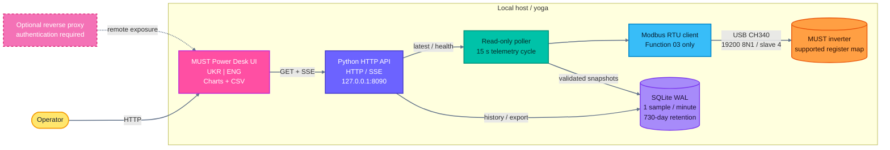

# MUST Power Desk v0.1.1


MUST Power Desk is a local, read-only web dashboard for MUST inverter families that expose the supported Modbus RTU register map. It polls telemetry through a USB serial adapter, stores one sample per minute in SQLite, aggregates history from 1-minute to monthly resolution, and streams live updates over Server-Sent Events.

The live-validated device for this release is a **MUST PV18-3224 VPM II**, identified by the firmware as **PV1800**.

## Highlights

- Read-only Modbus RTU polling using function `03` (Read Holding Registers).
- No inverter write commands, remote controls, or configuration mutations.
- Current telemetry for PV, battery, grid, AC output, load, temperatures, and accumulated counters.
- History resolutions: 1 minute, 30 minutes, hour, day, week, month, and raw samples.
- CSV export and a streaming `/api/events` endpoint.
- Bright, responsive dashboard with `UKR | ENG` language switching.
- SQLite WAL persistence with a 730-day default retention policy.
- Localhost binding and defensive HTTP/systemd security headers.

## Architecture

The application is deliberately small: a Python standard-library HTTP server, a serial poller, a SQLite store, and a static browser UI.



The optional reverse proxy is not part of the default deployment. If the dashboard is exposed beyond localhost, add authentication, TLS, rate limiting, and an explicit network policy first.

## Supported Inverter Models

Compatibility is protocol-scoped, not a claim that every hardware revision of a product family is identical. The decoder recognizes the following MUST machine types from the identity register block:

| Model family | Identity detection | Compatibility status |
| --- | --- | --- |
| `PC1600` | Machine type code `1600` | Register decoder implemented; hardware not validated in this deployment |
| `PH1800` | Machine type code `1800`, legacy software-version branch | Register decoder implemented; hardware not validated in this deployment |
| `PV1800` | Machine type code `1800`, PV software-version branch | **Live validated** with PV18-3224 VPM II |
| `PH3000` | Machine type code `3000` | Register decoder implemented; hardware not validated in this deployment |
| `PV3500` | Machine type code `3500` | Register decoder implemented; hardware not validated in this deployment |

These are the complete model labels currently recognized by the application code. Other MUST models, rebrands, or firmware revisions may work only if they expose the same addresses, lengths, scaling, signed-value conventions, and response framing. Always validate a new device on an isolated serial connection before relying on the readings.

## Requirements

- Linux with access to the USB serial device.
- Python 3.10 or newer.
- `pyserial` 3.5 or newer.
- A MUST inverter with the compatible register map.

## Quick Start

```bash
git clone https://github.com/weby-homelab/Must-Inverter-Dashboard.git
cd Must-Inverter-Dashboard
python3 -m venv .venv
. .venv/bin/activate
python3 -m pip install -r requirements.txt
cp .env.example .env
python3 -m unittest discover -s tests -v
python3 main.py
```

Open `http://127.0.0.1:8090` in a browser. The default `.env` keeps the service on localhost and uses the stable USB by-id path.

### One-command Linux installation

On Debian or Ubuntu, this command installs the OS prerequisites, clones the pinned release, creates the isolated Python environment, installs `pyserial`, creates the non-root service account, enables systemd, runs the tests, and waits for `/healthz`:

```bash
sudo apt-get update && sudo apt-get install -y ca-certificates curl && curl -fsSL https://raw.githubusercontent.com/weby-homelab/Must-Inverter-Dashboard/v0.1.1/install.sh | sudo bash
```

The installer places the application in `/opt/must-inverter-dashboard`, creates the `mustdash` account with serial access through `dialout`, and starts `must-inverter-dashboard.service`. If a `/dev/serial/by-id/` adapter is present, its first device is selected automatically; otherwise edit `/opt/must-inverter-dashboard/.env` before starting the service. The installer is intended for a clean or previously installer-managed directory and refuses to overwrite a checkout with local changes.

## Configuration

All runtime settings are optional and are documented in `.env.example`:

| Variable | Default | Purpose |
| --- | --- | --- |
| `MUST_DASH_HOST` | `127.0.0.1` | HTTP bind address |
| `MUST_DASH_PORT` | `8090` | HTTP port |
| `MUST_SERIAL_PORT` | `/dev/serial/by-id/usb-1a86_USB_Serial-if00-port0` | Stable serial device path |
| `MUST_SLAVE_ID` | `4` | Modbus unit ID |
| `MUST_BAUDRATE` | `19200` | Serial baud rate; framing is 8N1 |
| `MUST_POLL_INTERVAL` | `15` | Telemetry poll interval in seconds |
| `MUST_SAMPLE_INTERVAL` | `60` | Minimum persistence interval in seconds |
| `MUST_CONFIG_INTERVAL` | `300` | Read-only configuration refresh interval |
| `MUST_SERIAL_TIMEOUT` | `2.5` | Serial response timeout in seconds |
| `MUST_INTER_REQUEST_DELAY` | `0.5` | Delay between Modbus requests |
| `MUST_RETENTION_DAYS` | `730` | SQLite retention window |
| `MUST_DB_PATH` | `data/inverter.sqlite3` | SQLite database path |

The poller may read the inverter every 15 seconds, but persistence is rate-limited to one sample per minute. This keeps the raw database compact while preserving fine-grained history.

## Modbus Register Map

The application reads only the following verified holding-register blocks. Addresses are shown using the device documentation's one-based notation.

| Section | Start | Count | Data |
| --- | ---: | ---: | --- |
| `identity` | `20001` | `16` | Model, serial, hardware/software versions |
| `charger_status` | `15201` | `21` | PV voltage/current/power, charger state, temperatures |
| `inverter_status` | `25201` | `79` | AC, grid, load, battery, power, temperatures, counters |
| `charger_config` | `10101` | `24` | Read-only charging parameters |
| `inverter_config` | `20101` | `44` | Read-only inverter parameters |

Every response is framed and CRC-validated before decoding. A failed section is reported as degraded data instead of being silently treated as valid.

## History Resolutions

`/api/history` and `/api/export.csv` support these period values:

| Period | Aliases | Behavior |
| --- | --- | --- |
| `raw` | - | Raw samples, limited to the newest 20,000 points |
| `minute` | `1m` | One UTC bucket per minute |
| `30m` | `30min` | UTC buckets starting at minute `00` or `30` |
| `hour` | - | One UTC bucket per hour |
| `day` | - | One UTC bucket per UTC day |
| `week` | - | Monday-based UTC week bucket |
| `month` | - | One UTC bucket per month |

When `period=auto` or no period is supplied, the server selects `minute` for ranges up to 6 hours, `30m` up to 3 days, `day` up to 45 days, `week` up to 180 days, and `month` for longer ranges.

## API

| Endpoint | Description |
| --- | --- |
| `GET /api/current` | Latest decoded snapshot and health object |
| `GET /api/health` | Poller status, errors, latency, and SQLite statistics |
| `GET /healthz` | Readiness endpoint; returns `503` when offline or stale |
| `GET /api/history?range=24h&period=minute` | One-minute history |
| `GET /api/history?range=24h&period=30m` | Thirty-minute history |
| `GET /api/history?range=30d&period=day` | Daily aggregation |
| `GET /api/history?range=1y&period=month` | Monthly aggregation |
| `GET /api/history?range=24h&period=raw` | Newest raw samples |
| `GET /api/export.csv?range=30d&period=day` | CSV export for the same history query |
| `GET /api/events` | Server-Sent Events for snapshots and health changes |

Example requests:

```bash
curl -fsS http://127.0.0.1:8090/api/health
curl -fsS 'http://127.0.0.1:8090/api/history?range=24h&period=1m'
curl -fsS -OJ 'http://127.0.0.1:8090/api/export.csv?range=30d&period=day'
```

## systemd Deployment

The repository includes `deploy/must-inverter-dashboard.service`. The unit runs as non-root user `mustdash`, adds only the `dialout` group for serial access, and applies systemd filesystem/device hardening. The one-command installer above is the recommended path.

```bash
sudo useradd --system --user-group --home-dir /opt/must-inverter-dashboard --shell /usr/sbin/nologin mustdash
sudo usermod --append --groups dialout mustdash
sudo install -d -o mustdash -g mustdash -m 0750 /opt/must-inverter-dashboard/data
sudo install -o root -g mustdash -m 0640 .env.example /opt/must-inverter-dashboard/.env
sudo install -m 0644 deploy/must-inverter-dashboard.service /etc/systemd/system/must-inverter-dashboard.service
sudo systemctl daemon-reload
sudo systemctl enable --now must-inverter-dashboard.service
systemctl status must-inverter-dashboard.service
journalctl -u must-inverter-dashboard.service -f
```

The default deployment binds only to `127.0.0.1:8090` and grants write access only to `data`. Do not expose the service directly to the Internet.

## Security Model

- The Modbus client issues function `03` reads only.
- There is no write API and no UI control surface.
- The HTTP server defaults to loopback binding.
- Responses include CSP, frame, MIME-sniffing, referrer, permissions, and cross-origin policy headers.
- `.env`, SQLite databases, logs, and Python caches are excluded by `.gitignore`.
- Keep credentials outside the repository and never place tokens in README, source, issues, or release notes.

## Development and Verification

```bash
python3 -m unittest discover -s tests -v
python3 -m compileall -q .
node --check public/app.js
curl -fsS http://127.0.0.1:8090/healthz
```

The test suite covers signed register decoding, CRC and Modbus exception handling, HTTP readiness/security headers, SQLite migration, raw history limits, automatic period selection, and minute/30-minute bucket aggregation.

## v0.1.1 Release Notes

- Added one-minute and 30-minute history aggregation.
- Added automatic fine-resolution selection for short ranges.
- Added `UKR | ENG` language switching with browser persistence.
- Extended localization across current, history, diagnostics, and configuration views.
- Added version reporting to health responses.
- Documented the supported decoder model families and the read-only security boundary.

## Contributing

Contributions are welcome through issues and pull requests. Hardware compatibility changes should include the inverter model, firmware version, register evidence, and tests that do not send write commands.
